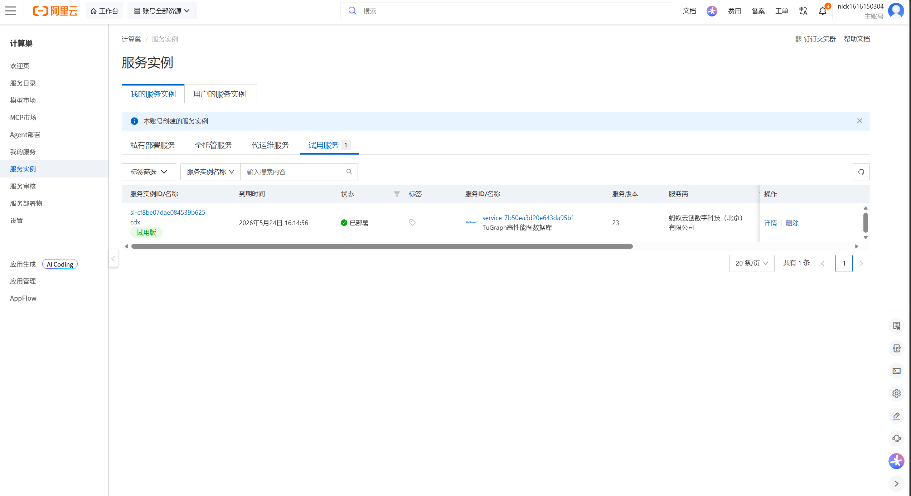
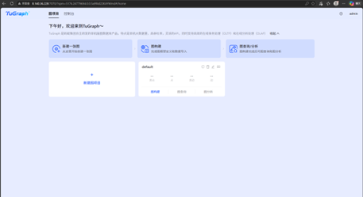
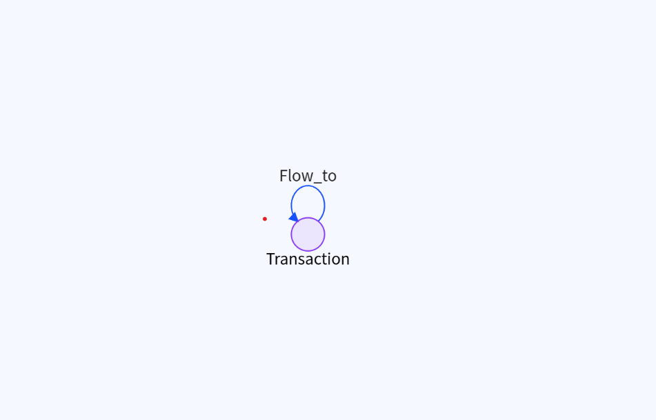
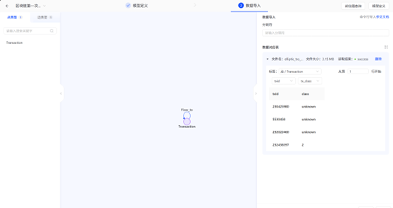
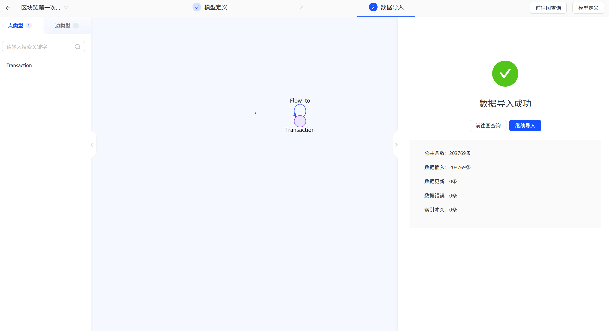
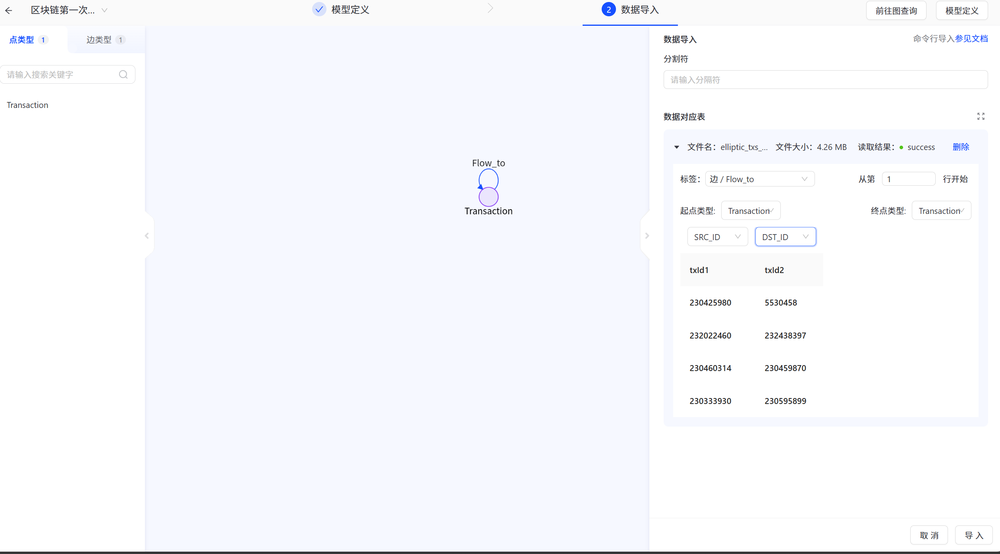
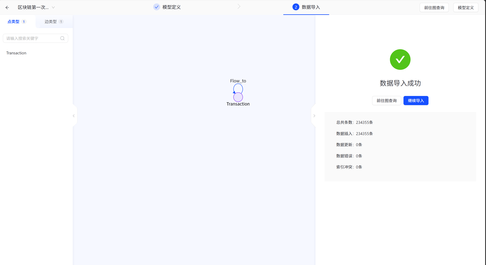
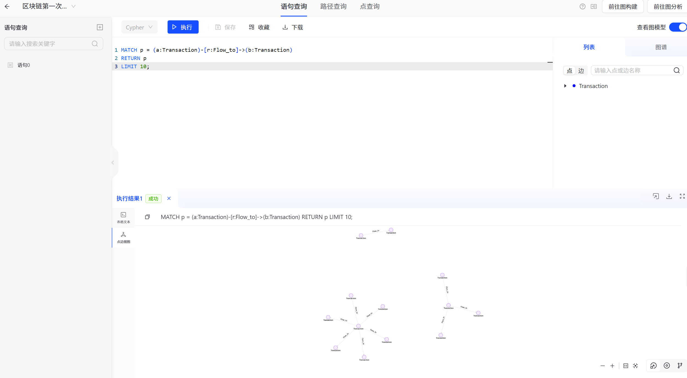
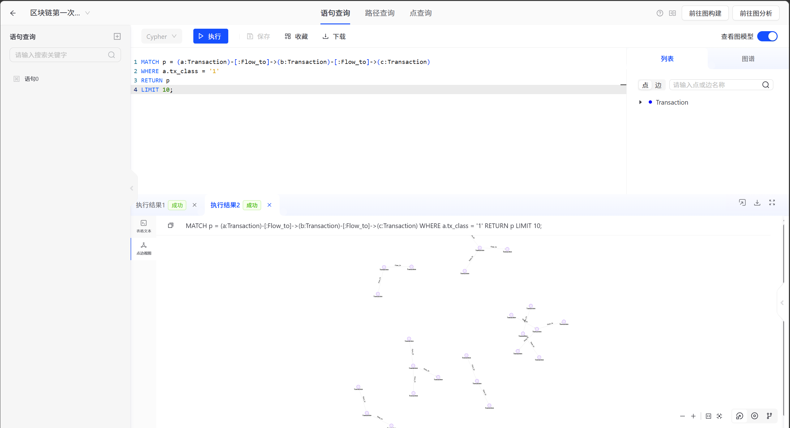

# TuGraph 图数据库实验报告：Elliptic++ 比特币交易网络分析

## 1. 实验基础知识

### 1.1 图数据库简介

图数据库是一类以图结构组织和管理数据的数据库系统，其基本组成包括节点、边和属性。其中，节点通常表示现实世界中的实体，边表示实体之间的关系，属性则用于描述节点或边的具体特征。与传统关系型数据库相比，图数据库更适合处理关系密集型数据，尤其适用于社交网络分析、金融交易网络、区块链资金流追踪、反洗钱分析和知识图谱等场景。

在区块链交易数据中，交易之间往往不是孤立存在的，而是通过资金流向形成复杂的网络结构。如果使用传统表结构进行分析，通常需要进行多次连接查询；而图数据库可以直接将交易建模为节点，将交易之间的资金流向建模为边，从而更加直观地展示交易之间的关联关系。

### 1.2 TuGraph 简介

TuGraph 是一款高性能图数据库系统，支持图数据存储、图建模、数据导入、Cypher 查询和图可视化分析等功能。本实验使用 TuGraph 对 Elliptic++ Transactions Dataset 进行图建模与查询操作，主要目标是掌握图数据库的基本使用流程，包括平台启动、图结构设计、数据导入以及 Cypher 查询。

### 1.3 数据集准备

本实验使用王老师提供的 Elliptic++ Transactions Dataset 交易数据，主要包括两个 CSV 文件：

| 文件名 | 主要字段 | 含义 |
|---|---|---|
| `elliptic_txs_classes.csv` | `txId`, `class` | 记录交易节点编号及其类别 |
| `elliptic_txs_edgelist.csv` | `txId1`, `txId2` | 记录交易之间的资金流向关系 |

其中，`elliptic_txs_classes.csv` 用于构建交易节点，`txId` 表示交易编号，`class` 表示交易类别；`elliptic_txs_edgelist.csv` 用于构建交易之间的有向边，`txId1 -> txId2` 表示资金从一笔交易流向另一笔交易。

因此，该数据集可以自然地建模为一张比特币交易资金流向图。

---

## 2. 启动 TuGraph 平台

### 2.1 部署 TuGraph 实例

本实验首先在阿里云计算巢中部署 TuGraph 服务实例。服务实例部署完成后，可以在实例管理页面查看服务状态、访问地址等信息。TuGraph 服务正常运行后，即可通过浏览器进入 TuGraph Web 管理界面。

部署成功界面如下：



### 2.2 登录 TuGraph 平台

完成服务部署后，在浏览器中访问 TuGraph Web 页面，并使用系统提供的用户名和密码登录平台。登录成功后，可以进入图项目首页，后续的建图、数据导入和查询操作均在该界面中完成。

登录成功界面如下：



---

## 3. Transactions Dataset 图建模与数据导入

### 3.1 新建图项目

进入 TuGraph 平台后，首先新建图项目。本实验新建的图项目用于存储和分析 Elliptic++ 比特币交易网络数据。新建图项目后，可以继续进行图模型定义和数据导入。

新建图项目界面如下：


### 3.2 图模型设计

根据 Transactions Dataset 的数据结构，本文将比特币交易网络建模为一张有向图。图模型包括一种点类型和一种边类型：

| 类型 | 名称 | 含义 |
|---|---|---|
| 点类型 | `Transaction` | 表示一笔比特币交易 |
| 边类型 | `Flow_to` | 表示两笔交易之间的资金流向 |

其中，`Transaction` 节点的主要属性包括：

| 属性名 | 含义 |
|---|---|
| `txid` | 交易编号 |
| `tx_class` | 交易类别 |

`Flow_to` 边的方向为：

```text
Transaction(txId1) -> Transaction(txId2)
```

也就是说，如果边数据中存在一行 `txId1, txId2`，则表示资金从交易 `txId1` 流向交易 `txId2`。通过这种建模方式，原本存储在 CSV 文件中的交易数据被转化为由节点和边组成的比特币交易网络。

图模型如下：



### 3.3 导入点数据

在完成图模型设计后，首先导入点数据。本文将 `elliptic_txs_classes.csv` 作为点数据文件导入 TuGraph，并将其映射到 `Transaction` 点类型。其中，CSV 文件中的 `txId` 字段映射为交易节点编号，`class` 字段映射为交易类别属性 `tx_class`。

点数据导入界面如下：



### 3.4 导入边数据

随后导入边数据。本文将 `elliptic_txs_edgelist.csv` 作为边数据文件导入 TuGraph，并将其映射到 `Flow_to` 边类型。边的起点和终点均为 `Transaction` 节点，其中 `txId1` 映射为起点交易编号，`txId2` 映射为终点交易编号。

边数据导入界面如下：



---

## 4. Cypher 查询示例

TuGraph 支持使用 Cypher 语言进行图查询。Cypher 是一种声明式图查询语言，可以通过节点、边和路径模式对图数据进行匹配和返回。本实验基于已经导入的比特币交易网络，分别设计了基础查询和复杂查询。

### 4.1 基础查询：查看前十条资金流向边

基础查询用于查看图数据库中已经导入的部分资金流向关系，验证交易节点和交易边是否成功建立。

Cypher 查询语句如下：

```cypher
MATCH p = (a:Transaction)-[r:Flow_to]->(b:Transaction)
RETURN p
LIMIT 10;
```

该语句表示匹配任意两个交易节点 `a` 和 `b` 之间的有向资金流关系，并返回由节点和边组成的路径 `p`。通过该查询，可以直观观察比特币交易网络中的单跳资金流向关系。

查询结果如下：



### 4.2 复杂查询：两跳资金流路径追踪

在完成基础资金流向查询后，本文进一步设计复杂查询，用于观察比特币交易网络中资金流动的连续传导关系。相比基础查询只展示单条边的资金流向，两跳路径查询可以展示资金从一笔交易出发，经过中间交易节点，再流向下一笔交易的过程。

Cypher 查询语句如下：

```cypher
MATCH p = (a:Transaction)-[:Flow_to]->(b:Transaction)-[:Flow_to]->(c:Transaction)
WHERE a.tx_class = '1'
RETURN p
LIMIT 10;
```

该语句的含义是：匹配从交易节点 `a` 出发，经由中间交易节点 `b`，最终流向交易节点 `c` 的两跳资金路径。其中，`a.tx_class = '1'` 表示以类别为 `1` 的交易节点作为路径起点。相比基础查询，该查询能够更直观地刻画资金在交易网络中的连续扩散过程，有助于理解图数据库在区块链交易追踪、异常交易识别和反洗钱分析中的应用价值。

查询结果如下：



---


## 5. 实验总结

通过本次实验，我初步掌握了 TuGraph 图数据库的基本操作流程，包括平台启动、系统登录、图项目创建、图建模、数据导入以及 Cypher 查询。实验将 Elliptic++ Transactions Dataset 建模为比特币交易资金流向图，其中交易记录被表示为 `Transaction` 节点，交易之间的资金流向被表示为 `Flow_to` 有向边。

从查询结果看，TuGraph 能够较为直观地展示比特币交易之间的连接关系。基础查询展示了单跳资金流向，复杂查询进一步展示了两跳资金路径，使交易网络中的连续资金传导过程更加清晰。相比传统表格数据，图数据库能够更自然地表达区块链交易网络中的关系结构，在资金路径追踪、异常交易识别和反洗钱分析等场景中具有较强的应用价值。
